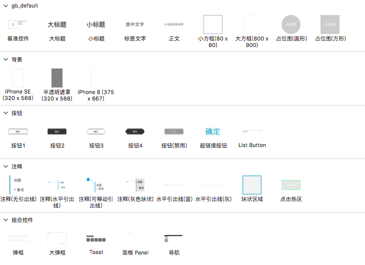

个人制作及从各处收集的优质Axure元件库

# 写在前面
虽然 Axure RP 的全称是 Axure Rapid Prototype，但是 Axure 的快速原型能力局限于 Web 1.0 时代。如果要制作演示用的交互原型，有很多更好用的工具，比如：
- Sketch
- Principle
- Keynote
- Adobe XD
- 墨刀

Axure 是很好用的 wireframing 工具，而不是 prototyping 工具。我对 Axure 的定位就是静态产品文档，速度和效果远远高于 Word、InDesign、OmniGraffle。

那些号称「全动态」的过分注重于可交互原型的元件库，在我看来一点用处都没有，所以也不会收录。

# 文件说明

`default/`
Axure原生提供的默认组件，针对字体、字号、图形填充及边框颜色等进行了修改，并同步更新了样式。

`ant.design/`
[Ant Design](https://ant.design/) 提供的快速原型组件库。[点击查看最新版](https://ant.design/docs/spec/download-cn)

`gb_default`
画了多年线框原型之后，决定返璞归真后的组件库。也是我个人目前主力使用的组件库。相比于画出好看的线框原型，高效、简洁地传递设计信息才是最重要的。

> 

`gb_customized`
随意创作的线框图组件库。

`gb_Apple Watch`
基于 Apple Watch 设计规范制作。尺寸符合 Apple Watch 规范。可以用作高保真原型制作。

`gb_metronic`（已删除）
~~基于Metronic后台UI主题制作。[了解Metronic主题](http://keenthemes.com/preview/metronic/)~~
推荐使用`ant.design`

`gb_WeChatUI`
根据微信小程序提供的 Photoshop 版设计素材文件，制作的 Axure 版元件库。[点击查看微信小程序UI素材](https://developers.weixin.qq.com/miniprogram/design/#%E8%B5%84%E6%BA%90%E4%B8%8B%E8%BD%BD)

# 使用方法
将`.rplib`文件复制到`Documents\Axure\Libraries`下即可。
Windows 将`Documents`译作`文档`，macOS将`Documents`译作`文稿`。

# 关于文档共享

用 Axure 写好的文档有几个办法共享出去：

1. 导出 HTML 文件，压缩 zip 发送
2. 发布到官方 Axshare（现在叫 Axure Cloud）
3. 导出 HTML 文件，上传到静态文件服务器，：
   1. 自己搭建，简陋的可以用 IIS 打开目录访问，颜值党的我写了个简单但更好看的`fixd-server`
   2. 专门的托管网站比如「产品大牛」
   3. 「蓝湖」提供了很好的自动上传插件，并且提供了版本管理和版本比较的功能。美中不足的 Bug 是页面名称重复时会互相覆盖，只能看到其中一个页面的内容。
4. 搭建私有的 Axshare 服务器：
   1. Axure 8 叫 Axshare，好处是服务端免费，只需要企业版客户端即可使用，坏处是不支持 Axure 9
   2. Axure 9 叫 Axure Cloud on-Premise，服务端需要额外购买 License 

Axshare 和 Axure Cloud on-Premise 的安装包几百 MB，放百度网盘了，为了避免流量太多被取消分享，放个二维码后台回复 `axshare`获取：

 # 优秀的设计资源站

- [Material Design](https://material.io/) 
- [Facebook Design](https://facebook.design/)

- [Fluent Design](https://www.microsoft.com/design/fluent/)

- [Ant Design](https://ant.design/)

# 修订记录

- 2020.3.29
  -  `gb_default`增加了几个适用于 300 宽度的手机背景
  - 更新了`Ant Design`的元件库
  - 移除了`input`组件库，其在 Axure 9 下已经不适用

# 写在后面

Axure 有几个弱点：
1. 流程图和图示的能力逊于 OmniGraffle 和 Visio
3. 矢量的图标库太丑、太少，只能用位图图标库妥协

如果有好的解决方案欢迎提 issue。
